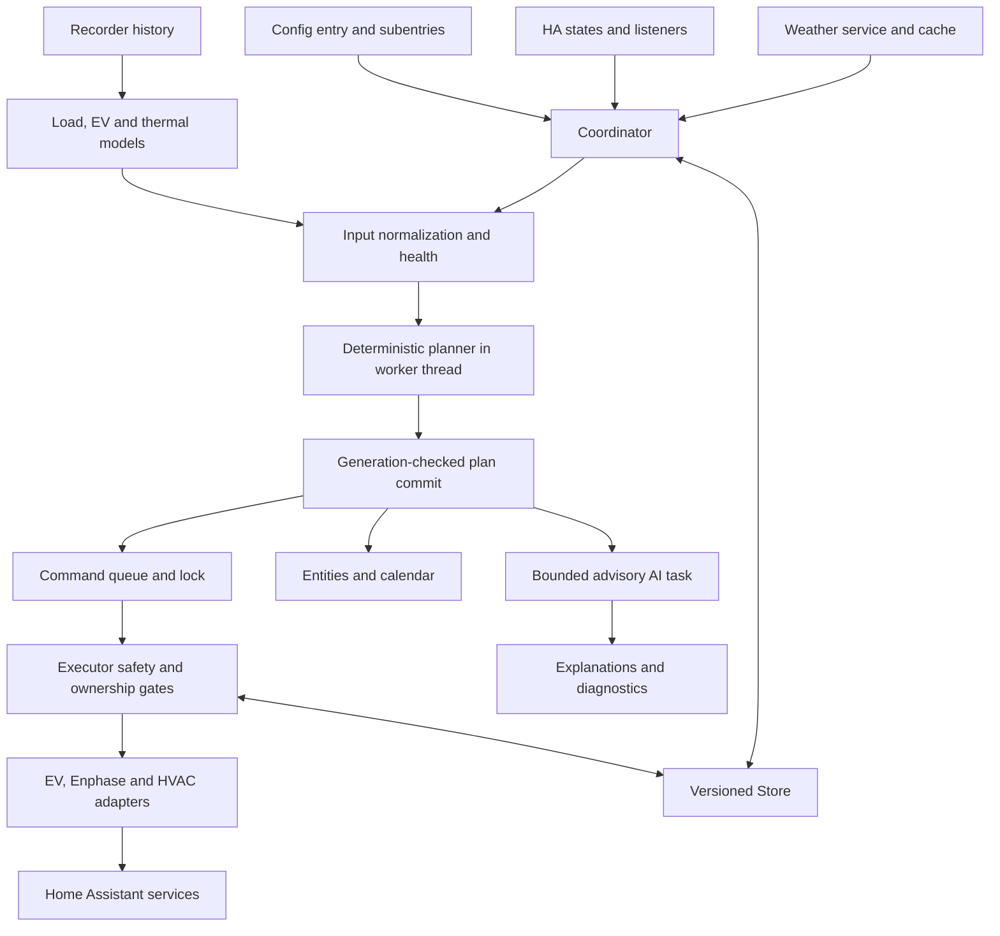

# Architecture review — 5 September 2026

Reviewed revision: `b3a1601` (after PR #66). The original findings and line references below describe that baseline. The subsequent implementation is recorded here separately. Priorities describe implementation order, not a Home Assistant certification or a guarantee that no other defects exist.

## Implementation and critical review

The user authorized all recommended improvements after the analysis, then requested a critical review of the resulting changes. Work was assigned to the three agents listed at the end of this report, with integration, compatibility, documentation and combined validation owned by the parent.

| Packages | Implemented boundary and behavior |
|---|---|
| C1, C3, H5, H6 | Enphase ownership is flushed before dispatch and preserves the original baseline. All adapter commands, including compensation, use a 30-second dispatch deadline. Setup cancellation cleans up actual runtime resources; teardown stops admission and drains started entry work. |
| H1–H4 | Five live platforms explicitly declare `PARALLEL_UPDATES = 0`, with coordinator transaction locks retaining cross-platform authority. EV options validate the proposed configuration. Retired descriptions, 44 exclusive helpers, empty number/time platforms and dead translation names were removed. Immutable retirement keys preserve registry upgrades; custom icons use `icons.json`. |
| C2, C4–C6 | Equivalent service/state helpers are shared. Pure battery, EV and HVAC planning modules preserve policy precedence. Enphase, HVAC ownership transitions and EV capacity reservation have explicit transaction/policy modules. Typed ownership, reservation and command contracts replace dynamic internal command objects. Forecast lookup uses binary search. |
| R1–R4 | Weather has a ten-second deadline with freshness recalculated after failure. EV import failures back off for 15 minutes using separate source-aware attempt metadata. Recorder retrieval and EV calibration run together off the event loop; short sessions are rejected before indexed SOC lookup. Provider `TypeError` causes one rejected call. |
| R5–R7 | Retained history migrates into one canonical bounded execution audit, preserving occurrence counts and the diagnostic recent-outcomes view. Known Store interfaces replace test-only persistence fallbacks. Weather and training are explicit services; AI, startup recovery and task-lifetime functions are staged module boundaries whose state and locks remain owned by the coordinator. |
| R8 | Background training is single-flight across entry reloads, coalesces source changes and rejects obsolete publication. AI parsing has total size, node and depth bounds; request attempts persist independently of accepted results, and related result writes are batched. Deferred notifications have entry ownership. |
| V1 | Behavioral CI checks the HACS minimum, pinned HA 2026.8.2 and current stable, including actual runtime contracts and Docker smoke tests. The full gate still requires exactly 100% statement coverage; branch instrumentation is reported separately. Quality checks now verify concurrency declarations and icon resources. |

The critical review identified further fixes within the implementation: retain the training lock through repeated cancellation; clear old training reasons on source change; use actual, durably flushed AI admission time; reject late AI results and notifications during teardown; catch JSON integer-conversion limits as well as decoding errors; and exclude arbitrary provider exception text from weather diagnostics. These paths have focused regression cases.

The largest source files changed from 4,240 to 3,142 lines for the coordinator, 3,104 to 2,717 for the executor, 2,841 to 882 for the planner, and 2,562 to 941 for sensors. Module extraction alone does not eliminate coupling: the coordinator deliberately retains lifetime, lock-order and plan-generation authority, and its staged extracts still access that shared state.

Reproducible synthetic measurements are available through `python3 -m scripts.benchmark_runtime` inside the Home Assistant Docker image. Three-run medians on the review machine were approximately 0.00043 / 0.00228 / 0.00895 seconds for 1,000 / 5,000 / 20,000 EV rows per source; the original 20,000-row workload took 2.398 seconds. Forecast lookup over 288 destination slots took 0.095 ms with 288 source rows and 0.104 ms with 10,000, compared with baseline 0.614 ms and 34.863 ms. These probes measure synthetic CPU workloads, not production end-to-end latency.

Decision-fingerprint profiling retained the full canonical input contract: two ordinary 288-row forecast sources cost approximately 0.23–0.43 ms; two unusually large 10,000-row sources cost 6.6–16.9 ms, depending on host contention. The benchmark script includes this probe. Narrowing consumed fields would risk ignoring supported nested forecast aliases; current coalescing already limits the cadence. Presentation caches were also left out because their invalidation would span plan, options, Store and wall time without demonstrated production benefit. Execution preflight remains fresh.

The real minimum-version smoke test additionally exposed use of a device-registry API unavailable in HA 2026.6. The migration now uses the supported entry-scoped API; real registry tests verify relinking, retirement, idempotence and preservation of other entries on all three supported runtime baselines.

Cross-version smoke testing also exposed fixture ordering assumptions. The fixture now establishes its synthetic baseline before arming, observes completed away-off before submitting a newer manual override, and drains synthetic HVAC feedback before clearing its scheduler guard. Away-off deliberately follows release of existing preconditioning ownership, so the bounded barrier explicitly requests the follow-up plan through the public refresh API. Task-stack inspection confirmed that the previous timeout was not a coordinator deadlock. Existing actuator and persisted-audit assertions remain intact. Docker console output uses a separate file from Home Assistant's own log to preserve diagnostic evidence.

Final combined validation completed successfully on 5 September 2026:

- `scripts/docker-validate.sh` passed without skip flags: compilation, Ruff, strict mypy across 56 source files, quality-scale evidence, all 1,308 tests, replay/live-schema/history fixtures, Home Assistant configuration validation, compatibility contracts and the real-runtime smoke scenario.
- Statement coverage was exactly 12,578 / 12,578 (100%); branch coverage was 4,623 / 4,768 (96.96%). The statement gate remains exact rather than relying on rounded coverage percentages.
- The compatibility subset passed 196 tests on each of HA 2026.6.0 and the pinned HA 2026.8.2. The full suite and final smoke used current stable HA 2026.9.0.
- Separate full smoke runs passed with `HEP_HA_IMAGE=ghcr.io/home-assistant/home-assistant:2026.6.0 scripts/docker-ha-smoke.sh`, `HEP_HA_IMAGE=ghcr.io/home-assistant/home-assistant:2026.8.2 scripts/docker-ha-smoke.sh`, and `KEEP_HA_SMOKE=1 scripts/docker-ha-smoke.sh` on stable. Each retained the real entity, service, actuator-state and persisted-storage assertions.
- Independent cross-review found no unresolved actionable findings in the final implementation or smoke-fixture changes. Validation used synthetic devices and fixtures; household operation and hosted GitHub Actions were not exercised by this local review.

## Original baseline assessment

The integration has a sound overall design and unusually extensive validation. Its deterministic planner, execution safety gates, device adapters, asynchronous persistence, and advisory-only AI are appropriate foundations for Home Assistant. However, I cannot confirm that it currently satisfies every Home Assistant best practice, or that its reliability and performance need no further work. Failure-path reproductions identified restoration and configuration defects; explicit quality-scale requirements are missing; and an allowed history workload can monopolize the event loop.

The first changes should address durable control ownership, bounded waits, and lifecycle races. Remove retired code next. Decompose the large modules incrementally after protecting those behaviors with regression tests.

## Reviewed architecture

Useful boundaries already present:

- `planner.py` operates on dataclasses and does not command Home Assistant. The coordinator dispatches planning CPU work through `async_add_executor_job` at `coordinator.py:1015`.
- Refresh and device execution use distinct locks. Plan generations prevent obsolete results from becoming current work. Event debounce, a refresh floor, input fingerprints and interval boundaries reduce unnecessary replanning.
- Execution checks ownership, production authorization, input health, manual overrides and action constraints. EV/HVAC paths already contain provisional ownership and compensation patterns worth reusing.
- `PlannerStore` uses Home Assistant `Store`, serializes outside the event loop, batches refresh writes, and tracks mutation generations so an in-flight save does not acknowledge newer unsaved data (`storage.py:48–73,247–297`). Preserve forced durability before commands.
- Typed `ConfigEntry.runtime_data`, `CoordinatorEntity`, stable entity IDs, device registration, translated action failures and bounded Recorder attributes match important HA conventions.
- AI output remains advisory, with bounded payloads, timeout handling and response validation. It has no direct device-control authority.
- Cross-entry actuator-conflict validation and shared EV reservations address multi-entry control conflicts.

## Scale and maintainability

AST/source inventory: **40 integration modules, 27,929 lines, 944 uses of `Any`**. `Any` is allowed by the current strict mypy configuration; this count indicates where richer internal contracts could help, not a type-check failure.

| Module | Lines | Architectural concern |
|---|---:|---|
| coordinator.py | 4,240 | Scheduling, input preparation, weather, learning, recovery, manual controls, execution queue, AI and notifications |
| executor.py | 3,104 | Multiple independent actuator transactions, restoration and policy gates |
| planner.py | 2,841 | EV, battery and HVAC policy plus shared calculations |
| sensor.py | 2,562 | Live entities, retired entities, presentation and diagnostic calculations |
| hvac_adapter.py | 1,497 | Large, safety-sensitive acquisition and rollback transaction |
| inputs.py | 1,345 | Normalization, forecast construction, health and fallback policy |
| config_flow.py | 1,246 | Schemas, migration, proposed-state validation and ownership checks |

The four largest files contain about 46% of integration source. `Executor.async_evaluate` spans 641 lines; planner `_actions` 361; HVAC `async_execute` 337; planner `_hvac_lifecycle_actions` 307. These are review and change-risk concentrations. Splitting files solely to meet a line limit would not improve them; extract cohesive responsibilities with explicit inputs, outputs and ownership of mutable state.

## Validated reliability and performance changes

All source references below are relative to `custom_components/ha_energy_planner/` unless a repository path is shown.

### H5 — Own and drain listener tasks across unload/reload (P1)

**Evidence:** Manual HVAC/helper work is launched through untracked `hass.async_create_task` calls (`coordinator.py:537–582,626–628`). Teardown removes listeners but waits only for the known plan task and refresh boundary. Manual transactions at lines 1825 and 1951 do not reject teardown after acquiring their locks.

**Reproduction:** Hold the command lock, enqueue a manual override, and run the actual configuration-reload unload path. Unload returns true and removes runtime data while the manual task remains pending. Releasing the lock afterward produces `save_overrides`, `save_ownership`, `helper_service`, and `release_hvac` effects from the old coordinator. This was independently rerun by the parent reviewer using real coordinator/unload methods with fake I/O.

**Change:** Track entry-owned work; stop admission at teardown; reject queued transactions under their relevant lock; safely finish and drain transactions that already crossed a device boundary. Include helper-off and startup reconciliation paths. Do not blindly cancel tasks after physical side effects. Preserve failed-unload listener restart.

**Acceptance:** queued manual/helper tasks cannot act after unload; unload waits for started transactions to reach a durable safe boundary; repeated reload leaves no old work; failed unload restarts without duplicate listeners/tasks. Add real HA lifecycle coverage alongside the function-level reproduction.

### H6 — Make setup cancellation clean up resources (P1)

**Evidence:** `__init__.py:356–385` starts listeners/recovery before platform forwarding finishes, registers the unload callback afterward, and catches `Exception`, which excludes `CancelledError`.

**Reproduction:** Cancel actual setup while forwarding is pending after listeners/recovery started. The resulting counters show one listener start, one recovery start, zero shutdown calls, retained runtime data, zero unload callbacks, and zero restore calls. This function-boundary reproduction was independently rerun; end-to-end framework cancellation behavior still needs a real HA fixture.

**Change:** Establish cleanup ownership as soon as runtime resources exist. Route cancellation through bounded cleanup while preserving the original cancellation exception. Handle partially forwarded platforms and ensure one cleanup failure cannot skip all remaining cleanup or runtime-data removal.

**Acceptance:** cancellation at first refresh, after listener/recovery start, and during forwarding removes or safely drains resources; required restoration runs; runtime data clears; original cancellation propagates. Normal setup failure and failed-unload recovery behavior remain intact.

### C1 — Persist Enphase ownership before dispatch (P1)

**Evidence:** `executor.py:1017–1045` dispatches the profile service before recording ownership; EV and HVAC save provisional ownership before commanding. The targeted restore path depends on ownership. Ordinary profile acquisition also replaces `enphase_profile` with the latest pre-state instead of preserving the original acquisition baseline.

**Reproduction:** A real executor/Enphase adapter with a fake service applied Self Consumption and then raised `CancelledError`. The profile changed, ownership remained `{}`, and no durable flush occurred. The targeted disable restoration call returned a restored outcome but left Self Consumption active. A full restore could return to configured AI, but the original custom baseline had been lost. This is specifically a loss of original/targeted restoration evidence; full restore does not always skip Enphase. A separate repeated-action reproduction replaced the original baseline with Self Consumption. Normal planning suppresses already-desired profile actions, so this latter case concerns repeated/stale execution at the executor boundary, not every refresh.

**Change:** Save and flush a provisional record before dispatch; preserve the first acquisition baseline; finalize after confirmation. Retain unresolved ownership when cancellation, timeout or uncertain acceptance makes rollback ambiguous. Preserve explicit planned `RESTORE_AI` behavior.

**Acceptance:** accepted-then-cancelled, accepted-then-timeout, durable-save failure, repeated acquisition/no-op, targeted disable and restart restoration tests. No service call if the pre-command save fails. No ownership removal before restoration is confirmed.

### C3 — Bound device service dispatch, including restoration (P1)

**Evidence:** `enphase_adapter.py:99,169`, `ev_adapter.py:711,731` and HVAC service calls await `hass.services.async_call(blocking=True)` without a deadline. Their feedback-confirmation timeout only begins after dispatch returns. The installed HA service implementation awaits the handler and supplies no general deadline. Execution holds the command lock (`coordinator.py:2703`).

**Impact:** A vendor service that never returns blocks subsequent same-entry safety stops, manual controls and unload restoration indefinitely.

**Change:** Apply explicit dispatch deadlines and typed uncertain outcomes across normal commands and compensation. Build on C1 first. A timeout means the command may have reached the device; it must not be treated as proof that nothing happened. Preserve cancellation propagation and ownership until reconciliation.

**Acceptance:** never-returning handler, accepted-then-hung handler, late device feedback, failed compensation, queued stop responsiveness and unload tests. Timeouts cannot guarantee cancellation of work already running in another integration or device; recovery must reconcile observed state.

### R1 — Bound advisory weather requests (P1)

**Evidence:** `_async_weather_forecast` awaits the weather service without a timeout at `coordinator.py:2610`; its caller holds `_planner_lock` at `coordinator.py:838–847`. Manual-control and shutdown paths also need that lock.

**Change:** Bound the service await, then use the existing same-entity cache/legacy fallback. Recalculate cache freshness after the wait so a response delay cannot extend the freshness allowance. A ten-second private default is a proposed engineering choice, not an existing requirement. Keep cancellation distinct from ordinary provider failure.

**Acceptance:** hung provider releases the planner lock; fresh cache works; cache that expires during the wait is rejected; wrong-entity cache is rejected; cancellation propagates without changing cache state.

### R2 — Back off failed EV history imports (P2)

**Evidence:** `recorder_import.py:230–233` returns the unchanged model after Recorder/history-limit failures. The due check therefore remains satisfied, allowing every actual replan to retry the same potentially thirty-day history scan.

**Change:** Record bounded attempt metadata and a retry deadline while retaining the last safe learned values. Keep failed-attempt configuration identity separate from trained-model identity. A fifteen-minute failure interval is a proposed default; source, charge-rate or model-version changes must invalidate it.

**Acceptance:** one failed attempt per retry window, exact-expiry retry, immediate retry after configuration changes, handling of malformed/future timestamps, history-limit failure backoff, and cancellation propagation. Old coefficients must remain invalid for a newly selected source.

### R3 — Move EV calibration off the event loop and index SOC lookups (P2)

**Evidence:** History retrieval is offloaded, but `build_ev_charge_calibration` runs after the await at `recorder_import.py:222–229`. `_ev_charge_calibration_samples` repeatedly scans SOC history for each charging session (`ev.py:248–289`) and performs lookups even before rejecting sessions that are too short.

**Measurement:** A local synthetic thirty-day noisy history benchmark measured approximately 0.007 seconds for 1,000 rows per side, 0.143 seconds for 5,000, and **2.398 seconds for the allowed 20,000 rows per side**. This is a workload reproduction on the review machine, not a production latency measurement.

**Change:** Run history retrieval and pure calibration in an executor; reject impossible durations early; index sorted timestamps with binary search or a monotonic traversal. Preserve duplicate-timestamp and staleness semantics.

**Acceptance:** matching calibration results on existing fixtures, duplicate/out-of-order/stale SOC cases, executor-thread identity and event-loop responsiveness checks, and before/after scaling measurements. Avoid brittle absolute runtime assertions in unit tests.

### R4 — Do not retry an AI provider on arbitrary TypeError (P2)

**Evidence:** `ai_advisor.py:140–149` calls the provider again without `return_response` on any `TypeError`. The exception may originate inside a provider that already performed work. Supported HA versions accept response-returning service calls.

**Change:** Remove the obsolete signature fallback; classify provider `TypeError` through the existing bounded error path.

**Acceptance:** a handler that records a call and raises `TypeError` is invoked exactly once; timeout, cancellation, first-use unknown AI Task state and valid response handling remain unchanged.

### H2 — Validate the complete proposed EV configuration (P2)

**Evidence:** `_validate_subentry_config` uses existing `entry.options` at `config_flow.py:983–987`, before later merged-option validation.

**Reproduction:** Submitting Keep charger on = false while replacing a persistent charger switch with separate start/stop buttons returns `ev_keep_on_requires_persistent_control`, even though the proposed configuration is valid.

**Change:** Build the proposed mappings/options together before cross-field validation. Preserve the existing ability to edit unrelated options while existing mapped entities are temporarily unavailable.

**Acceptance:** switch-to-buttons plus disabling keep-on succeeds; buttons-to-switch plus enabling succeeds; keep-on without persistent control still fails; unrelated edits remain possible during an upstream outage.

## Home Assistant conformity and evidence

### H1 — Declare platform parallel-update policies (P2)

All seven entity platforms omit `PARALLEL_UPDATES`; `quality_scale.yaml:300` nevertheless marks the rule done. HA explicitly requires choosing a policy. Use `0` for read-only coordinator platforms; assess action platforms separately, including whether serialization would delay emergency disarm. Platform limits do not replace cross-platform/domain-service command locking. [Official parallel-updates rule](https://developers.home-assistant.io/docs/core/integration-quality-scale/rules/parallel-updates/).

Acceptance includes concurrent entity and domain-service calls and a contract check for every platform, rather than only asserting that a constant exists.

### H4 — Implement icon translations and correct exemptions (P2)

Live entity descriptions/classes set static icons directly; no `icons.json` exists. `quality_scale.yaml:486` marks icon translations exempt, while the current official rule has no exceptions. Move custom icons to existing translation keys, use appropriate device-class defaults, and validate packaging/HA loading. [Official icon-translations rule](https://developers.home-assistant.io/docs/core/integration-quality-scale/rules/icon-translations/).

The README correctly calls Platinum a self-assessment. The local evidence validator passes, but validates declared statuses and references rather than proving all runtime requirements. Its exemption allowlist explicitly permits this invalid icon exemption. Passing it is not sufficient confirmation of the claim.

### V1 — Improve executable evidence and compatibility validation (P2)

- The HACS minimum is HA 2026.6.0, strict mypy runs against 2026.8.2, and runtime tests use mutable `stable`. Add a minimum-supported runtime/import/lifecycle job plus a current stable job. Keep one reproducible pinned baseline and a deliberate update policy; do not remove forward-compatibility coverage.
- Unit tests extensively use local fakes, direct private helpers and `asyncio.run`. Keep deterministic unit tests, but add real HA config-entry lifecycle tests for cancellation, forwarding, reload and unload callback behavior. The Docker smoke test is valuable, but runs weekly/on demand in CI, not on every behavioral PR.
- Add focused real-HA checks for changes affecting lifecycle, services or platforms; retain scoped CI so documentation changes do not trigger unrelated expensive checks.
- The configured 100% coverage gate measures statements. Supplemental branch instrumentation found 161 partially covered branches. Report branch coverage and target failure/interleaving scenarios; do not manufacture tests merely to inflate coverage percentages.
- Enforce key quality claims with executable contracts: platform concurrency declarations, icon resources/exemptions and minimum-version imports. Verify documented references still describe live entities. `entity-unavailable` evidence references a retired surface; `log-when-unavailable` describes persistence, which is not equivalent to transition logging. Determine which integration owns each upstream availability transition before adding logs. [Official availability logging rule](https://developers.home-assistant.io/docs/core/integration-quality-scale/rules/log-when-unavailable/).

## Redundant code and structural changes

### H3 — Retire executable legacy sensors; separate presentation (P2)

`sensor.py:77–321` retains complete legacy descriptions, but `_remove_retired_sensors` at line 422 only needs their keys. Static reachability from all eight live sensors, entity classes and imports from other integration modules identified **44 helper definitions, approximately 607 lines**, used exclusively by retired implementations, in addition to the roughly 245 description lines. Treat this as a deletion candidate set requiring live-output and migration checks, not a promise that every line can be removed unchanged.

Replace old descriptions with immutable migration keys. Remove exclusively retired implementations and tests that only instantiate those unused entities; retain registry migration coverage and live contracts. `calendar.py:28` imports five private sensor helpers: move shared action presentation to a neutral module before removing or reorganizing helpers.

Other cleanup in this package: ignored entity `device_key`, the discarded `entry` argument/untyped wrapper in `async_add_planner_entities`, unused `PlannerSwitchDescription.reload_required`, repeated retired-registry removal loops, and the number platform that exists only for retirement migration. Preserve upgrades from supported prior releases.

### C2 — Consolidate genuinely equivalent adapter/parsing helpers (P3)

AST comparison found exact body duplication in Enphase service resolution (`enphase_adapter.py:223`, `executor.py:3041`), adapter state getters (`enphase_adapter.py:193`, `ev_adapter.py:850`, `hvac_adapter.py:1402`), and several finite-number, entity-list and datetime parsers.

Extract narrow named helpers only after comparing complete contracts. Similar parsers intentionally differ on non-finite numbers, booleans, deduplication and naive time zones; blindly replacing them with one generic parser would risk changing safety behavior. Keep boundary-specific wrappers where needed and parameterize shared tests.

### R5 — Consolidate duplicated persisted outcome streams (P3)

`storage.py:97–119` serializes and maintains both `execution_audit` and `outcomes`, each capped at 100 entries. Most runtime consumers use the audit; preflight has a legacy fallback, while diagnostics exposes both streams. This is bounded redundancy, not an unbounded memory leak.

Design one canonical retained audit with a versioned/load-time migration, preserving required fields, occurrence counts and diagnostic compatibility. Measure serialized size/write cost before changing it. Keep ownership durability independent of historical audit consolidation.

### R6 — Remove test-double compatibility branches; strengthen internal contracts (P2/P3)

`coordinator.py:2383–2407` explicitly implements alternate persistence paths for test stores; similar fallbacks exist for dry-run comparisons and lifecycle collaborators. Production code should not have a non-persisting alternative solely because a fake omits a real method. Upgrade shared fakes/protocols and call the known production interface.

Introduce typed contracts incrementally for ownership, production/recovery state, EV reservations, calibration metadata and service results. Keep flexible dictionaries at external/schema boundaries, then validate into typed internal structures. This improves the value of existing strict mypy without a repository-wide annotation-only rewrite.

### R7/C4 — Decompose coordination and asset execution in stages (P2/P3)

After the failure-path fixes, extract weather/cache handling, history-training orchestration, startup recovery, AI request lifecycle and entry-owned task management from the coordinator. Keep lock ordering, generation checks, Store boundaries and entry lifetime owned explicitly by the coordinator; avoid components each inventing their own locks.

Split executor per-asset acquisition/restoration transactions behind shared gating and audit contracts. Split planner EV/HVAC/battery policy into pure modules that return actions and evidence. Preserve global precedence, daylight/ready-by policy, manual override authority and shared capacity constraints. First extracts should have behavior-equivalence tests using existing replay fixtures. Every coordinator extraction must also retain lifecycle, lock-order, generation and queued-execution interleaving tests; output equivalence alone cannot verify concurrency safety.

Repeated presentation-time calculation of preflight/merged options/calendar events is another profiling target. Cache only derived snapshots with explicit invalidation for option, Store, plan and time changes; execution-time safety checks must always remain fresh. No production hot-path timing evidence currently justifies changing those checks.

### C5/C6 — Forecast indexing and typed transaction records (P3)

`forecasts.py:117–120,555–573` repeatedly scans source timestamps for each destination slot. A local exact-helper benchmark for 288 destination slots measured 0.614 ms with 288 source points and 34.863 ms with 10,000 historical source points; an output-equivalent binary-search prototype measured roughly 0.1 ms. Ordinary inputs are inexpensive, so this is lower priority than R3. Use an index or monotonic sweep while preserving duplicate timestamps, gaps and final-cadence limits; compare full normalized fixtures before and after.

C6 applies the internal typing work from R6 specifically to ownership and adapter results. Replace dynamic field probing with validated `TypedDict`/dataclass records and deliberate protocols; retain corrupt-persistence rejection and asset-specific recovery semantics. Coordinate these changes with storage migrations and C1/C3 rather than editing the same transaction paths concurrently.

### R8 — Additional bounded runtime improvements (P3/design backlog)

These are concrete inspection targets and follow-up designs, not reproduced production failures:

- **Background training:** Recorder import/training still waits under the planner lock even when CPU is offloaded. Consider single-flight background training with last-safe-model publication, source/generation matching, lifecycle ownership and timing diagnostics. Row limits alone do not bound database wait time. Cancelling an executor await does not stop its thread: reject late results after unload/configuration changes and prevent overlapping training jobs.
- **Decision fingerprints:** `coordinator.py:3273–3303` serializes configured state attributes. Profile payload size, then consider including only consumed decision fields. Preserve every forecast alias/nested input that can change a decision.
- **AI parse limits:** `ai_advisor.py:448–472,511` processes provider wrappers/text before a total size/depth bound. Add bounded raw response parsing with tests for oversized/nested input; the provider timeout cannot interrupt synchronous parsing.
- **AI attempt accounting:** Cancelled/obsolete calls may not retain the timestamp used for request accounting because results are recorded only if still current (`coordinator.py:2835,2916–3001`). Track sanitized attempts independently of accepted results. Current requests are manual; this is not evidence of an automatic request storm.
- **AI save batching:** Consider using the existing Store batch context for recommendation/snapshot updates (`coordinator.py:2961–2992`) while preserving transaction durability and notifications.
- **Deferred notifications:** Include the AI startup notification callback (`coordinator.py:3036–3042`, `notifications.py:52`) in H5 teardown tests so old entry callbacks cannot surface after unload.

## Validation performed

`scripts/docker-validate.sh` **passed** on the reviewed revision:

- Ruff passed.
- Strict mypy passed: 40 source files.
- Pytest: **1,279 passed**, one upstream Home Assistant/aiohttp deprecation warning.
- Statement coverage: **12,484 / 12,484, 100%**.
- Shell syntax, export dry runs, quality evidence, replay/live-schema/history fixtures passed.
- HA `check_config` passed.
- Docker smoke entity/service/storage assertions passed.

The expected synthetic-fixture failures for the real-data profiles also behaved correctly. No sanitized real `real_*` fixture bundle was available, so this is not verification against the user's live household or vendor devices.

Supplemental `coverage run --branch -m pytest -q -p no:cacheprovider` also passed all 1,279 tests. It measured 4,870 branches with 161 partially covered branches; combined statement/branch coverage rounded to 99%. The supplementary run did not change the required gate. Its first attempt encountered a generated bytecode cache from a review reproduction; the cache was removed and the repeat passed.

Additional evidence came from read-only Docker reproductions and the synthetic calibration benchmark described above. No live HA commands were issued. No PR, commit, release or production change was made.

## Assigned implementation design work

These are the original subagent assignments. They first reviewed and designed the packages, then implemented them after the user's subsequent authorization; see the implementation section above.

| Owner | Assigned packages | Delivery boundary |
|---|---|---|
| `control_safety` | C1 durable Enphase ownership; C3 bounded device dispatch; C2 equivalent helper cleanup; C4 per-asset execution/planner decomposition; C5 forecast indexing; C6 typed transactions | Ownership/transaction regression matrix, adapter timeout semantics, behavior-preserving extraction plan |
| `runtime_performance` | R1 weather deadline; R2 failed-import backoff; R3 off-loop/indexed calibration; R4 single-call AI errors; R5 audit consolidation; R6 fake/interface cleanup; R7 coordinator decomposition; R8 bounded runtime backlog | Runtime acceptance cases, source-aware retry design, benchmark evidence, storage migration and component boundaries |
| `ha_lifecycle` | H1 concurrency; H2 proposed-config validation; H3 retired entities/presentation; H4 icons; H5 listener task lifetime; H6 setup cancellation; V1 validation/evidence | HA conformity fixes, live entity/migration invariants, cancellation/unload reproductions, compatibility and quality gates |

Implementation order: C1 before C3; H5/H6 before coordinator extraction; R1 and R2/R3 can proceed independently of adapter work; H3 precedes the final icon map so deleted entities are not migrated unnecessarily. R5 needs an explicit data migration. Share helper/parsing changes only after the asset transaction fixes settle. C6 and R6 are coordinated parts of the same typing initiative, not independent competing rewrites.

The coordinator is touched by runtime and lifecycle work, and `ev.py` by calibration and planner extraction. Those packages must land sequentially or in isolated worktrees with deliberate reconciliation. Each behavioral change must include focused regression tests and the complete repository validation gate before it is considered complete. Update `CHANGELOG.md`, README/requirements evidence and `quality_scale.yaml` where relevant to implemented behavior.

## Official references

- [HA integration quality scale](https://developers.home-assistant.io/docs/core/integration-quality-scale/)
- [Typed config-entry runtime data](https://developers.home-assistant.io/docs/core/integration-quality-scale/rules/runtime-data/)
- [Strict typing](https://developers.home-assistant.io/docs/core/integration-quality-scale/rules/strict-typing/)
- [Config-entry unloading](https://developers.home-assistant.io/docs/core/integration-quality-scale/rules/config-entry-unloading/)
- [Working with async](https://developers.home-assistant.io/docs/asyncio_working_with_async/)
- [Blocking operations](https://developers.home-assistant.io/docs/asyncio_blocking_operations/)

The positive assessment is based on present code and validation, with earlier project decisions used only to preserve intended behavior. The review does not replace long-running production observation or prove all possible concurrency schedules safe.
