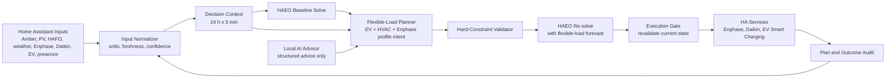

# ha-energy-planner: Custom Integration Specification

> **v0.6 native EV uplift:** Energy Planner now owns EV smart-charging optimization and directly controls a configured charger switch or start/stop controls. Native Target SOC and Ready by entities supersede the v1 dependency on EV Smart Charging. Legacy keys remain readable only for migration. Where the historical v1 text below refers to EV Smart Charging, the v0.6 implementation and requirement evidence in `docs/requirements-audit.md` take precedence.

## 1. Purpose

`ha-energy-planner` is a Home Assistant custom integration that coordinates
home energy decisions. It uses HAEO as the deterministic optimizer for energy
flows, and adds the planning and execution logic that HAEO intentionally does
not provide:

- EV charging requirements and execution through the existing EV Smart
  Charging integration.
- Daikin HVAC preconditioning and expensive-period suppression.
- Enphase battery profile takeover for import/export arbitrage.
- Occupancy-aware HVAC policy.
- Hard-constraint validation, execution safety, audits, and rollback.
- A bounded local AI advisor for explanations, anomaly detection, and
  whitelisted soft-policy adjustments.

The integration must be local-first and must not include credentials in source
control. It must fail closed: data, model, integration, or Home Assistant
failures restore existing behavior instead of leaving an autonomous controller
in charge.

## 2. Scope

### 2.1 Initial controllable assets

1. Enphase battery system.
2. Daikin HVAC system.
3. EV charging through the existing EV Smart Charging integration.

Small flexible loads, lights, and appliance control are explicitly out of the
first release. The integration should be structured so later planners can add
them without changing the core plan, safety, or audit contracts.

### 2.2 In scope

- A rolling 24-hour plan at five-minute resolution.
- Replanning every five minutes and when material input changes occur.
- Amber import and export prices, PV forecast, baseline-load forecast, weather,
  occupancy, device state, and vehicle state.
- Configurable, hard constraints for battery reserve, EV SOC, EV ready-by time,
  and occupied HVAC comfort.
- Cost-minimizing grid/battery planning through HAEO.
- Automatic control, subject to hard constraints, freshness checks, and manual
  override rules.
- Local AI advice within a deterministic policy envelope.
- Dry-run, diagnostics, replay, test, and gradual-enable modes.

### 2.3 Out of scope for v1

- Directly commanding battery charge or discharge power if the available
  Enphase integration exposes only profiles/modes. The integration uses every
  verified control that is available, but never assumes an undocumented
  command exists.
- Replacing HAEO, Amber, HAFO, solar forecasting, Enphase, Daikin, or EV Smart
  Charging.
- Cloud LLM use, LLM-controlled device services, or free-form AI changes to
  hard constraints.
- A separate database or Home Assistant App/add-on. A future App is an
  escalation path only if custom-integration compute or storage becomes too
  large for Home Assistant Core.

## 3. Agreed Operating Policy

| Area | Policy |
| --- | --- |
| Default objective order | Cost, comfort, EV readiness, battery reserve, solar self-consumption, carbon. All priorities are configurable. |
| Battery reserve | Configurable hard constraint; default 10% SOC. |
| Battery arbitrage | Allowed. The integration may grid-charge at low prices and discharge/export at high prices when feasible. Battery degradation cost is not included initially. |
| Enphase ownership | The integration may temporarily change Enphase profile/mode when beneficial, with a minimum 30-minute profile hold. It restores Enphase AI Optimisation when planner control is no longer justified. |
| HVAC when away | Turn Daikin off when both `person.james` and `person.cath` are away. No arrival prediction is required. |
| HVAC when home | Use existing climate target helpers. Occupied comfort is a configurable hard range of plus/minus 10% around each target by default. |
| HVAC coordination | Temporarily disable relevant existing climate automations when planner action is active. Control Daikin directly, then restore each automation to its prior enabled state. |
| HVAC manual action | A manual Daikin change triggers a configurable temporary override; default two hours. |
| EV target | Forecast next-day driving energy from vehicle trip history, constrained by configurable minimum and maximum SOC. |
| EV ready-by | Configurable helper; default 07:00 local time. |
| EV control | Use the existing EV Smart Charging integration rather than direct MINI commands. |
| Failure behavior | Restore Enphase AI Optimisation, restore prior Daikin automation state, and return EV Smart Charging to its pre-takeover behavior. |
| AI | Local model only. It may explain, detect anomalies, learn from overrides, and recommend whitelisted soft adjustments. It cannot change hard constraints or call device services. |

## 4. User-Facing Requirements

### 4.1 Functional requirements

The integration shall:

1. Build a normalized five-minute decision context for the next 24 hours.
2. Obtain a HAEO baseline plan from prices, PV, load forecasts, grid limits,
   battery state, and configured battery limits.
3. Build hard constraints from user options and current state.
4. Schedule EV charging to meet forecast driving needs by the active
   `ready_by` deadline at the lowest feasible cost.
5. Schedule HVAC interventions only while occupied, or to honour an explicit
   preconditioning rule introduced in a future configuration option.
6. Delay or suppress an HVAC automation when the comfort range remains valid
   and an expensive tariff period makes the action uneconomic.
7. Project flexible EV/HVAC demand into a second HAEO solve so the battery and
   grid plan reflects the intended flexible-load schedule.
8. Validate every planned action immediately before execution.
9. Publish a human-readable plan, health, next action, confidence, and audit
   status as Home Assistant entities.
10. Keep a compact audit record of plans, execution attempts, outcomes,
    overrides, and fallbacks.

### 4.2 Non-functional requirements

- All scheduler work must avoid blocking the Home Assistant event loop.
- A stale, failed, or incomplete plan must never control a device.
- All device commands must be idempotent and rate-limited.
- Repeated input events must be debounced and coalesced.
- The integration must restore safe ownership state across restart, unload, and
  setup failure.
- Entity IDs and service details must be configurable; no environment-specific
  entity ID may be hard-coded in Python.
- Logs and diagnostics must redact tokens, API responses containing secrets,
  and personally identifying location details.

## 5. Architecture



### 5.1 Separation of responsibility

| Component | Responsibility | Must not do |
| --- | --- | --- |
| Source integrations | Expose current state and forecasts. | Make cross-device decisions. |
| HAEO | Optimize grid, solar, battery, and forecast load energy flows. | Fetch forecasts, infer intent, or control devices. |
| `ha-energy-planner` | Compose inputs, create EV/HVAC/profile plan, validate and execute it. | Depend on HAEO private implementation internals. |
| Home Assistant automations | Continue normal HVAC scheduling outside planner takeover. | Override active planner ownership without the agreed handoff. |
| Local AI advisor | Produce bounded recommendations and explanations. | Call services, modify hard constraints, or replace the deterministic planner. |

### 5.2 Two-pass planning loop

1. Normalize forecast and current-state inputs.
2. Call or wait for HAEO to solve the baseline system.
3. Use HAEO forecast output with EV and HVAC constraints to create candidate
   flexible-load actions.
4. Convert candidate actions into projected flexible-load power forecasts.
5. Run HAEO a second time with projected flexible demand included.
6. Validate the final schedule against hard constraints and live ownership.
7. Publish the plan and execute only the immediate eligible action.

Version 1 performs one re-solve. Iterative re-solving is deferred until replay
tests show it is needed and does not cause plan oscillation.

## 6. Home Assistant Integration Inventory

The config flow must discover entities where possible and allow remapping when
entity IDs change. The following current entities are expected starting points.

| Domain | Current source or control | Use |
| --- | --- | --- |
| Amber | `sensor.amber_express_home_general_price` | Import price and forecast. |
| Amber | `sensor.amber_express_home_feed_in_price` | Export price and forecast. |
| Amber | `binary_sensor.amber_express_home_price_spike` | Price-spike input and diagnostic signal. |
| HAEO | `haeo.optimize` service and HAEO forecast sensors | Baseline and second-pass energy-flow plan. |
| HAEO | Grid, battery, solar, load, and price forecast entities | Forecast exchange and validation. |
| Enphase | Enphase battery SOC, grid, PV, consumption, and system profile entities | Current energy state and profile control verification. |
| Daikin | `climate.daikinap02966` | Direct HVAC mode and target control. |
| Daikin | `sensor.daikinap02966_power` | HVAC power and thermal-model input. |
| Climate helpers | `input_number.climate_target_low`, `input_number.climate_target_high` | Existing occupied comfort targets. |
| Climate safeguards | `input_boolean.climate_manual_override`, `input_boolean.climate_change_from_scheduler`, `timer.climate_scheduler_guard` | Reuse or map existing scheduler coordination features after inspection. |
| Weather | `weather.burwood_east`, `weather.burwood_east_hourly` | Outdoor forecast and HVAC model inputs. |
| Local weather | Wet-bulb temperature and precipitation entities | Optional HVAC/weather features. |
| Presence | `person.james`, `person.cath` | Home/away decision. |
| Occupancy | Existing room occupancy binary sensors | Future diagnostic and optional comfort extensions; not required for away decision in v1. |
| MINI | Battery SOC, charging status, location/presence, remaining charging time | EV state and trip-history input. |
| EV Smart Charging | Existing charge start/stop switches/buttons, charge-rate and SOC helpers | Only EV execution interface in v1. |
| Local conversation agent | Existing local AI model configured in Home Assistant | Bounded advisory interface; exact agent/service discovered during setup. |

### 6.1 Required discovery before control is enabled

The integration must inspect and record, through supported Home Assistant
services and entity capabilities:

1. Exact Enphase profile/mode services, supported options, asynchronous state
   transitions, and restore-to-AI action.
2. The list of existing climate automation entity IDs that must be disabled
   during takeover.
3. Exact EV Smart Charging controls and their observable confirmation state.
4. The local conversation agent service, its structured-output capability, and
   timeout behavior.
5. MINI history availability. If historical trip data cannot be retrieved,
   record future trip energy locally and use a configurable conservative EV
   fallback SOC until enough history exists.

## 7. Configuration Model

### 7.1 Config entry

The initial config flow should collect only the minimum safe mapping:

- HAEO hub/optimization service.
- Amber import/export price entities.
- Enphase SOC, profile state, and profile-control service mapping.
- Daikin climate entity and relevant climate automation entity IDs.
- Existing climate low/high target helpers.
- Both person entities used for occupancy.
- MINI SOC, charging, and presence entities.
- EV Smart Charging control entities.
- Baseline/PV forecast entities.

The config flow must validate units, supported service domains, and availability
before creating the entry. It must never issue a device control action while
validating configuration.

### 7.2 Options flow

All policy values are options-flow values, not Python constants.

```text
planning_horizon_hours: 24
planning_interval_minutes: 5
default_ready_by: 07:00
battery_min_soc_percent: 10
ev_min_soc_percent: configurable
ev_max_soc_percent: configurable
occupied_temperature_tolerance_percent: 10
manual_hvac_override_minutes: 120
enphase_profile_min_hold_minutes: 30
planner_enabled: false initially
dry_run: true initially
priority_weights: configurable ordered weights
```

Additional options should include price freshness timeout, forecast freshness
timeout, material-change thresholds, minimum savings for Enphase takeover, and
AI enabled/disabled state.

### 7.3 Hard versus soft policy

Hard constraints are inviolable in both planning and execution:

- Battery SOC floor.
- EV minimum/maximum SOC and active ready-by target, subject only to physical
  infeasibility.
- Occupied HVAC temperature bounds derived from existing target helpers.
- Maximum grid import/export limits.
- Device availability, manual overrides, minimum profile hold, and minimum
  HVAC cycling rules.

Soft objectives are ranked and configurable:

1. Cost.
2. Comfort quality within the allowed range.
3. EV readiness margin above the hard requirement.
4. Battery reserve above the hard floor.
5. Solar self-consumption.
6. Carbon intensity, when a suitable signal is configured.

## 8. Decision Data Contracts

Use Python dataclasses or typed dictionaries in the initial implementation to
avoid unnecessary dependencies. All timestamps are timezone-aware and stored
in UTC internally.

### 8.1 `ForecastPoint`

```text
issued_at: datetime
valid_at: datetime
source: str
value: float
unit: str
confidence: float | None
fresh_until: datetime
```

### 8.2 `DecisionContext`

```text
created_at: datetime
plan_id: str
slots: list[DecisionSlot]
current_battery_soc_percent: float
current_ev_soc_percent: float | None
occupancy_state: occupied | away | unknown
haeo_status: ready | stale | failed
input_health: healthy | degraded | unsafe
active_overrides: list[Override]
```

Each `DecisionSlot` contains:

```text
valid_at
import_price
export_price
pv_forecast_kw
baseline_load_forecast_kw
projected_ev_load_kw
projected_hvac_load_kw
outdoor_temperature_forecast_c
occupied
haeo_battery_soc_forecast_percent
haeo_grid_import_forecast_kw
haeo_grid_export_forecast_kw
```

### 8.3 `PlanAction`

```text
action_id: str
plan_id: str
execute_not_before: datetime
execute_not_after: datetime
asset: enphase | daikin | ev
kind: set_profile | restore_ai | set_hvac | ev_start | ev_stop | ev_schedule
desired_state: dict
hard_constraints: list[str]
reason_codes: list[str]
expected_cost_delta: float | None
confidence: float
requires_haeo_plan_id: str | None
```

### 8.4 `ActionOutcome`

```text
action_id: str
attempted_at: datetime
result: applied | skipped | rejected | failed | restored
reason: str
pre_state: dict
post_state: dict
plan_id: str
```

No full 24-hour plan is stored as a large entity attribute. Persist the full
plan with `Store`; publish a compact status, the next action, and a limited
preview in entity attributes.

## 9. Planner Algorithms

### 9.1 Baseline load and PV

- Use HAFO and the existing solar forecast as primary forecasts.
- Record forecast-versus-actual error per time slot.
- Apply a bounded calibration factor only after replay tests demonstrate an
  improvement over the source forecast.
- Keep controllable EV and HVAC consumption out of baseline load.

### 9.2 EV scheduling

1. Determine whether the EV is connected and eligible for charging.
2. Determine current SOC, configured minimum/maximum SOC, charge rate, and
   active ready-by time.
3. Estimate next-day driving energy from recorded trip history. The forecast
   method must be documented and conservative when history is sparse.
4. Clamp required target SOC to configured minimum and maximum values.
5. Allocate required charging energy to the least-cost feasible slots before
   ready-by, considering HAEO grid/battery/PV forecast and charger limits.
6. If the target is infeasible, choose the maximum attainable SOC, raise a
   persistent alert, and retain the evidence in the outcome log.
7. Execute through EV Smart Charging and verify its observable state.

### 9.3 HVAC policy

1. When both configured people are away, direct Daikin off and do not apply
   comfort optimization.
2. When either person is home, read existing target helpers and calculate the
   allowed hard temperature range.
3. Let normal climate automations operate unless the planner has a justified
   suppression or preconditioning action.
4. For takeover, save the enabled state of every mapped climate automation,
   disable only those that can conflict, call Daikin directly, and keep the
   minimum cycle/rest rules.
5. On expiry, successful handoff, manual override, failure, or restart, restore
   every saved automation state exactly as it was.
6. A manual Daikin change creates a two-hour override by default. During the
   override, no planner action may alter Daikin or climate automation state.

The first release can use bounded preconditioning heuristics. A learned thermal
model is introduced only after historical replay validates that it reduces cost
without increasing comfort violations.

### 9.4 Enphase policy

1. Treat configured battery SOC floor and grid import/export limits as hard.
2. Use HAEO to evaluate the value of grid charging, discharging, and export.
3. Change Enphase profile/mode only when the expected benefit exceeds the
   configurable takeover threshold and no manual or failure hold is active.
4. Enforce a 30-minute configurable profile hold before another profile change.
5. Restore Enphase AI Optimisation when takeover benefit ends, on planner
   failure, or when planner control is disabled.
6. Verify each transition through the observed Enphase profile/status entity.
   Do not assume a successful service call implies a successful device change.

No battery-cycle wear cost is included in v1. Efficiency and available battery
limits should still be represented by HAEO where those inputs are available.

## 10. AI Advisor

### 10.1 Responsibilities

The local model may:

- Explain a deterministic plan in plain language.
- Flag missing, stale, contradictory, or low-confidence inputs.
- Identify unusual forecast or execution outcomes.
- Learn from recurring user overrides and recommend soft-policy adjustments.
- Produce structured plan critiques.

### 10.2 Forbidden actions

The local model must not:

- Call Home Assistant services.
- Select or modify Enphase profile, Daikin setting, or EV controls directly.
- Change battery reserve, comfort range, EV bounds, ready-by time, manual
  override state, or profile-hold period.
- Bypass staleness, health, or ownership guards.
- Receive raw secrets, access tokens, or unnecessary location history.

### 10.3 Allowed automatic suggestions

The deterministic validator may accept only these whitelisted values, clamped
to configured bounds:

| Adjustment | Initial bound |
| --- | --- |
| HVAC preconditioning lead time | 0 to 120 minutes |
| Forecast confidence buffer | 0% to 30% |
| Minimum expected savings for planner takeover | Configured bounded range |

### 10.4 AI contract

The integration sends a compact, redacted summary and requires valid JSON:

```json
{
  "alerts": ["PV forecast confidence is low"],
  "suggested_precondition_lead_minutes": 30,
  "suggested_forecast_buffer_percent": 10,
  "suggested_takeover_savings_threshold": 0.25,
  "reasoning_summary": "High evening import prices make earlier heating preferable.",
  "confidence": 0.74
}
```

Malformed, timed-out, unsupported, or out-of-range AI output is discarded and
logged. The deterministic plan remains valid without AI.

## 11. Execution and Ownership State Machine

### 11.1 Global states

```text
DISABLED
DRY_RUN
ACTIVE_HEALTHY
ACTIVE_DEGRADED
MANUAL_HVAC_OVERRIDE
FAILSAFE_RESTORE
```

### 11.2 Required execution checks

Before every action, confirm:

1. Planner is enabled and not in dry run.
2. Plan is current and has not expired.
3. All required inputs are fresh and valid.
4. HAEO status is healthy for actions that depend on it.
5. Asset is available and reports a supported state.
6. No active user/manual override conflicts with the action.
7. Hard constraints remain satisfied after the action forecast.
8. The action does not violate Enphase profile hold or HVAC cycle/rest rules.
9. The command is materially different from current state.

### 11.3 Failsafe restore

Entering `FAILSAFE_RESTORE` must be idempotent and perform these operations in
order where supported:

1. Stop planner-owned EV schedule/action and return EV Smart Charging to its
   pre-takeover behavior.
2. Restore Enphase AI Optimisation.
3. Restore saved climate automation enabled states.
4. Clear planner HVAC ownership but preserve the user manual override timer.
5. Publish an unhealthy status and persistent notification with a redacted
   actionable reason.

## 12. Home Assistant Entities and Services

### 12.1 Entities created by the integration

| Entity | Meaning |
| --- | --- |
| `sensor.ha_energy_planner_next_action` | Compact representation of the next eligible action. |
| `sensor.ha_energy_planner_plan_status` | Plan ID, age, health, and high-level summary. |
| `sensor.ha_energy_planner_estimated_daily_cost` | Estimated plan cost for the active 24-hour horizon. |
| `sensor.ha_energy_planner_forecast_confidence` | Combined input confidence. |
| `binary_sensor.ha_energy_planner_data_healthy` | Required inputs are fresh and consistent. |
| `binary_sensor.ha_energy_planner_takeover_active` | Planner owns one or more asset controls. |
| `switch.ha_energy_planner_enabled` | Master execution enable. Defaults off. |
| `switch.ha_energy_planner_dry_run` | Plan and audit without device actions. Defaults on. |
| `switch.ha_energy_planner_ai_enabled` | Enables local advisory calls only. |
| `button.ha_energy_planner_replan` | Request an immediate debounced replan. |
| `button.ha_energy_planner_restore_safe_state` | Explicitly restore Enphase/climate/EV ownership. |

### 12.2 Services

```text
ha_energy_planner.replan
ha_energy_planner.restore_safe_state
ha_energy_planner.set_ev_ready_by
ha_energy_planner.set_manual_hvac_override
ha_energy_planner.export_diagnostics
```

Services must validate input, return quickly, and schedule heavy work in the
background. None may expose tokens or raw plan history in an error response.

## 13. Implementation Design

### 13.1 Custom integration structure

```text
custom_components/ha_energy_planner/
  __init__.py
  manifest.json
  const.py
  config_flow.py
  coordinator.py
  inputs.py
  models.py
  forecasts.py
  haeo_adapter.py
  planner.py
  constraints.py
  executor.py
  ownership.py
  storage.py
  ai_advisor.py
  diagnostics.py
  sensor.py
  binary_sensor.py
  switch.py
  button.py
  services.yaml
  strings.json
  translations/en.json
```

### 13.2 Core lifecycle

1. `async_setup_entry` loads versioned stored state and registers platforms.
2. `InputManager` subscribes to mapped state changes and time triggers.
3. Events mark the plan stale and request a debounced coordinator refresh.
4. The coordinator creates a snapshot, validates input health, and dispatches
   CPU-bound planning using `hass.async_add_executor_job` when required.
5. The coordinator publishes entities and stores the compact plan/audit record.
6. `Executor` evaluates only the next due action and performs a fresh-state
   validation before any service call.
7. `async_unload_entry` cancels timers, safely restores ownership if active,
   unloads platforms, and flushes persistent state.

### 13.3 Event and scheduling rules

Trigger a debounced replan when:

- Five-minute planning boundary is reached.
- Amber price or forecast changes.
- PV/load/weather forecast changes materially.
- Enphase SOC/profile/grid state changes materially.
- EV connection, SOC, charging status, or ready-by helper changes.
- Either person enters or leaves home.
- Daikin mode, target, or temperature changes.
- A planner enable, dry-run, priority, or constraint option changes.

Use a single planner lock and cancel/reject obsolete plan computation results.
An older solve may never overwrite a newer plan.

### 13.4 Dependencies

Initial implementation should use Home Assistant APIs and Python standard
library modules where possible. Do not import HAEO private Python modules.

- HAEO interaction: Home Assistant entities and supported service calls only.
- Forecast/history: mapped forecast entities plus Home Assistant Recorder data
  where supported.
- Optimization: deterministic scheduling heuristics in v1. Add a declared,
  tested solver dependency only when replay results show the heuristic cannot
  meet constraints economically.
- AI: Home Assistant's configured local conversation/model service through a
  narrow adapter. The integration must function with this adapter disabled.

## 14. Persistence and Diagnostics

Use `homeassistant.helpers.storage.Store` with a versioned schema for:

- Current active plan and next action.
- Saved pre-takeover ownership state.
- Manual override expiry.
- Compact forecast snapshots and action outcomes.
- Trip-history summaries and thermal-model parameters.
- AI recommendations, accepted fields, and rejection reasons.

Keep raw high-frequency history in Recorder rather than duplicating it in the
Store. If retained forecast snapshots or model training data make Core storage
or compute unsuitable, migrate only those functions to a separate App and
time-series database without changing the entity/service contract.

Provide `async_get_config_entry_diagnostics` with redacted input health,
entity mapping, plan metadata, recent action outcomes, and HAEO status. Do not
include API tokens, raw local-model prompts, addresses, or full location data.

## 15. Test Strategy

### 15.1 Unit tests

- Unit and timestamp normalization.
- Forecast freshness and confidence calculation.
- Hard-constraint validation.
- EV target clamping and infeasibility handling.
- HVAC away, occupied, manual override, and automation-state restoration.
- Enphase profile hold and restore logic.
- AI schema validation and bounds clamping.
- Plan serialization and storage migration.

### 15.2 Home Assistant integration tests

- Config and options flow validation.
- State listeners and five-minute trigger behavior.
- Debounce, cancellation, and stale-plan race handling.
- Entity updates and service validation.
- Safe unload and restart recovery.
- Service-call sequencing with mocked Enphase, Daikin, EV Smart Charging, and
  HAEO entities/services.

### 15.3 Replay tests

Replay recorded days containing:

- High/negative Amber price events.
- Low and high PV days.
- EV connected/disconnected before ready-by.
- Occupied and away transitions.
- HVAC load during cold and warm weather.
- Manual Daikin intervention.
- Missing or stale forecast data.
- Enphase service failure or delayed profile confirmation.

Compare baseline behavior with dry-run plan cost, comfort violations, EV
readiness, SOC floor adherence, and action count.

### 15.4 Rollout gates

| Phase | Device control | Minimum acceptance criteria |
| --- | --- | --- |
| Dry run | None | Seven days of valid plans, no hard-constraint simulation violations, diagnostics complete. |
| EV | EV Smart Charging only | EV target met in replay and live observation; no unwanted charging on stale data. |
| HVAC | Daikin takeover enabled | No comfort-bound violation; manual override and automation restore verified. |
| Enphase | Profile takeover enabled | Profile hold and restore-to-AI verified; grid/battery constraints remain respected. |
| AI bounded tuning | No new service authority | All AI output schema/bounds/audit paths verified. |

## 16. Implementation Plan

### Milestone 1: Integration foundation and dry run

Build:

- Manifest, config flow, options flow, config-entry lifecycle, and tests.
- Entity mapping, source validation, input freshness, and health sensor.
- Five-minute scheduler and material-change debounce.
- Decision-context and plan data models.
- HAEO adapter that reads/publishes only supported entities/services.
- Compact plan status, next action, diagnostics, and audit storage.
- Deterministic dry-run plan generation with no device service calls.

Exit criteria:

- The integration can run continuously for seven days in dry run.
- It publishes a current 24-hour plan and correct health state.
- A stale input always suppresses a control-eligible action.

### Milestone 2: Constraint engine and replay harness

Build:

- Hard-constraint evaluator shared by planning and execution.
- Forecast snapshot/outcome capture and replay fixtures.
- EV trip-history summarizer and target calculation.
- HVAC ownership state machine and Enphase profile hold state machine.
- Historical replay CLI/test utility using sanitized fixtures.

Exit criteria:

- Replays demonstrate correct rejection of invalid actions.
- Restore behavior is covered by automated tests.

### Milestone 3: EV execution

Build:

- Adapter for the current EV Smart Charging entities/services.
- Ready-by helper handling and EV schedule output.
- Immediate state confirmation and failure recovery.

Exit criteria:

- Manual test of start, stop, schedule, disconnect, missed deadline, and
  restore behavior.

### Milestone 4: Daikin overlay execution

Build:

- Discovery/configuration of conflicting climate automations.
- Direct Daikin action adapter.
- Saved automation-state restoration.
- Manual-change detection and two-hour override.
- Conservative preconditioning/suppression heuristics.

Exit criteria:

- No conflicting automation changes during takeover.
- Existing scheduling resumes exactly after every exit path.

### Milestone 5: Enphase profile execution

Build:

- Verified Enphase service/profile mapping.
- Takeover benefit threshold, 30-minute hold, status confirmation, and AI
  restore action.
- Second-pass HAEO planning with flexible-demand forecast.

Exit criteria:

- A full profile change/hold/restore cycle passes manually and in tests.
- Failures reliably restore AI Optimisation.

### Milestone 6: Local AI advisor and learning

Build:

- Local-agent adapter with strict JSON schema and timeout.
- Redacted context summarizer.
- AI recommendation validation, bounds clamping, and audit log.
- Forecast error calibration and a conservative HVAC thermal model after enough
  observed history exists.

Exit criteria:

- Planner behavior is unchanged when AI is unavailable.
- Every accepted AI adjustment is within configured bounds and attributable.

## 17. Security and Operational Requirements

- Do not store the previously shared Home Assistant token in the repository,
  examples, diagnostics, or tests. Rotate it before implementation begins.
- Use Home Assistant config-entry storage for secrets and redact diagnostics.
- Require all external/local integrations to be local-network reachable where
  possible.
- Use least privilege. The integration requires only the Home Assistant service
  actions it actually executes.
- Back up Home Assistant configuration before enabling execution phases.
- Maintain a one-click `restore_safe_state` action and document manual recovery
  steps in the repository README.

## 18. Open Discovery Tasks

These are not unresolved product decisions; they are implementation discovery
tasks that must complete before the relevant execution milestone:

1. Inventory Enphase services and profile options exposed in this installation.
2. Identify the exact Daikin automation entity IDs and their expected state
   machine behavior.
3. Verify EV Smart Charging service calls and success indicators.
4. Identify the local Home Assistant conversation/model agent and whether it
   can reliably return structured JSON.
5. Verify MINI trip-history availability and establish the fallback SOC option.
6. Confirm forecast attribute formats and units for Amber, PV, HAFO, and HAEO.

## 19. First Build Definition

The first code change is Milestone 1 only. It creates a dry-run custom
integration with no device service calls. The first release must make the
proposed plan, inputs, health, hard constraints, and failure handling visible
before it is allowed to control EV, HVAC, or Enphase equipment.
